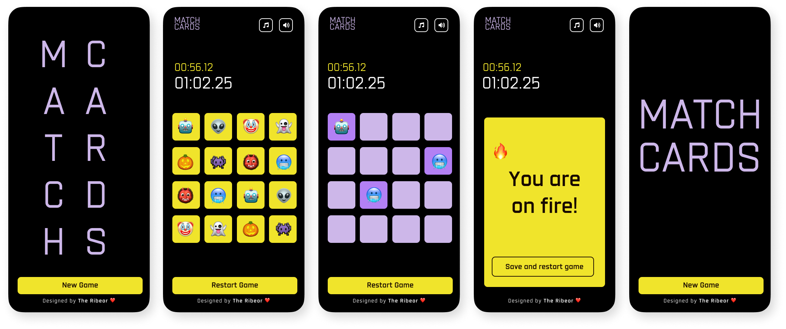

# MatchCards 🃏

¡Bienvenido a **MatchCards**! Una aplicación de juego de memoria interactiva y divertida, diseñada para desafiar tu capacidad de recordar y emparejar cartas. Con una interfaz atractiva, efectos de sonido y animaciones, esta aplicación te mantendrá entretenido mientras mejoras tu memoria.

---
### Expo Snack  

Prueba la versión interactiva del juego **MATCH CARDS** en Expo Snack:  

➡️ [MATCH CARDS - Expo Snack](https://snack.expo.dev/@diegoberrio1601/-matchcards)  

---
## Capturas de Pantalla 📸



---

## Características Principales 🚀

- **Juego de Memoria**: Encuentra y empareja cartas con emojis.
- **Temporizador**: Controla tu tiempo y trata de superar tu mejor marca.
- **Efectos de Sonido**: Sonidos interactivos que mejoran la experiencia.

## Características Principales 🚀

- **Juego de Memoria**: Encuentra y empareja cartas con emojis.
- **Temporizador**: Controla tu tiempo y trata de superar tu mejor marca.
- **Efectos de Sonido**: Sonidos interactivos que mejoran la experiencia de juego.
- **Animaciones**: Cartas que giran y efectos visuales atractivos.
- **Personalización**: Controla la música y los efectos de sonido desde el menú de opciones.
- **Diseño Responsivo**: Interfaz optimizada para dispositivos móviles.

---

## Estructura del Proyecto 🗂️

El proyecto está organizado de la siguiente manera:

```
MatchCards/
├── assets/                  # Recursos gráficos, fuentes y sonidos 
│   ├── fonts/               # Fuentes personalizadas
│   └── tasks/               # Sonidos
├── src/                     # Código fuente de la aplicación
│   ├── components/          # Componentes reutilizables
│   │   ├── BackButton.js    # Botón de retroceso
│   │   ├── Card.js          # Componente de carta
│   │   ├── Footer.js        # Pie de página
│   │   ├── GameController.js # Controlador del juego
│   │   ├── HeaderButtons.js # Botones de la cabecera
│   │   └── Timer.js         # Temporizador del juego
│   ├── context/             # Contextos de React
│   │   └── SoundContext.js  # Contexto para manejar sonidos
│   ├── navigations/         # Configuración de navegación
│   │   └── AppStack.js      # Navegación principal
│   └── screens/             # Pantallas de la aplicación
│       ├── GameScreen.js    # Pantalla del juego
│       └── LobbyScreen.js   # Pantalla de inicio
├── App.js                   # Punto de entrada de la aplicación
├── index.js                 # Archivo de inicio
└── package.json             # Dependencias del proyecto
```

---

## Instalación ⚙️

Sigue estos pasos para configurar el proyecto en tu máquina local:

1. Clona el repositorio:

   ```bash
   git clone git@github.com:Diegoberrio1601/MatchCards.git
   ```
   o

    ```bash
   git clone https://github.com/Diegoberrio1601/MatchCards.git
   ```

2. Instala las dependencias:

   ```bash
   npm install
   ```

   o

   ```bash
   yarn install
   ```

3. Ejecuta la aplicación:

   ```bash
   npx expo star 
   ```

   o

   ```bash
   yarn expo star 
   ```

---

## Uso 🎮

1. **Pantalla de Inicio (Lobby)**:
    - Presiona "New Game" para comenzar.
    - Disfruta de las animaciones de las letras mientras se prepara el juego.
2. **Pantalla del Juego (Game)**:
    - Encuentra y empareja las cartas antes de que se acabe el tiempo.
    - Usa los botones de la cabecera para controlar la música y los efectos de sonido.
    - Al completar el juego, se mostrará una animación de celebración.
3. **Reiniciar el Juego**:
    - Presiona "Restart Game" para comenzar de nuevo.

---

## Tecnologías Utilizadas 🛠️

- **React Native**: Framework para construir aplicaciones móviles.
- **Expo**: Plataforma para desarrollar y desplegar aplicaciones móviles.
- **React Navigation**: Manejo de navegación entre pantallas.
- **Expo AV**: Reproducción de sonidos y música.
- **Animated**: Animaciones fluidas y personalizadas.
- **AsyncStorage**: Almacenamiento local para guardar el mejor tiempo.

---


## Créditos 👏

- **Desarrollado por**: [Diego Berrio](https://github.com/Diegoberrio1601)
- **Inspiración**: Juegos de memoria clásicos.
- **Sonidos**: Efectos de sonido personalizados.
- **Animaciones**: Cartas que giran y efectos visuales atractivos.
- **Personalización**: Controla la música y los efectos de sonido desde el menú de opciones.
- **Diseño Responsivo**: Interfaz optimizada para dispositivos móviles.

---
